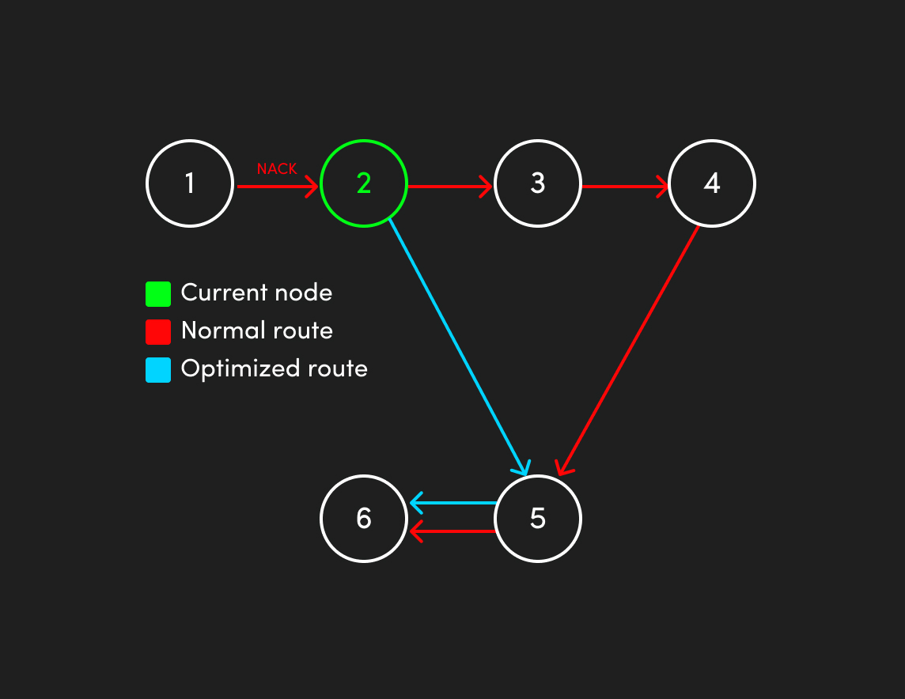
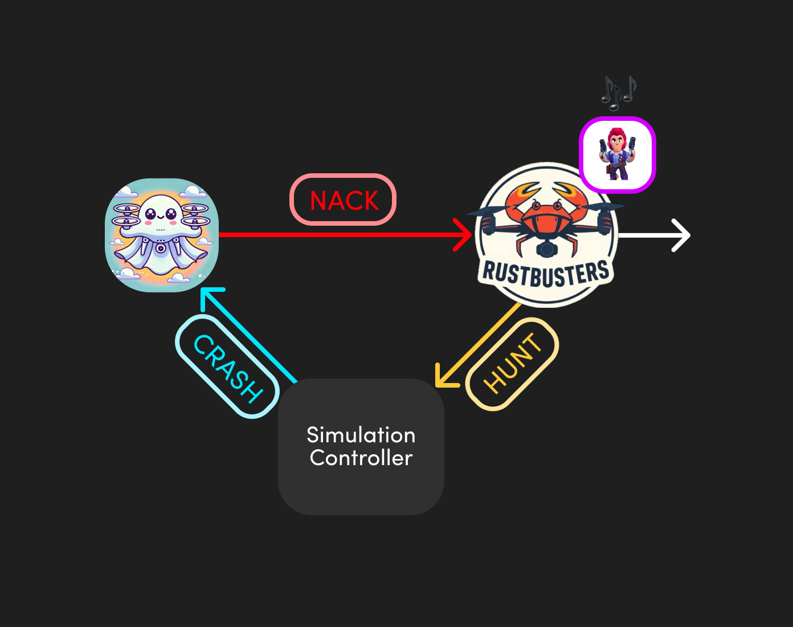

# RustBusters Drone

The `RustBustersDrone` is a software-defined drone designed to work in a distributed network simulation.
It was developed for the Advanced Programming course 2024 at the University of Trento.
It provides robust capabilities for handling packet routing, communication, and control commands.

## Basic drone features

These features are the one standardized for every single drone implementation.

### **Packet Handling**

- **Packet Forwarding**: Routes packets through a defined path, with validation of recipient and hop indices.
- **Nack Management**: Sends negative acknowledgments (Nack) based on routing outcomes or errors.
- **Packet Drop Simulation**: Implements a configurable Packet Drop Rate (PDR) to simulate real-world communication
  failures.

### **Flood Management**

- **Flood Request Handling**: Processes and forwards `FloodRequest` packets to neighboring drones while preventing
  redundant processing of the same request.
- **Flood Response**: Sends responses back to the initiator of the flood request with the path trace.

### **Control Commands**

- **Crash**: Stops the drone's operations gracefully.
- **Add Sender**: Dynamically adds communication channels for new neighbors.
- **Set Packet Drop Rate**: Configures the PDR dynamically to test network resilience.

## RustBusters features 😎

### **Optimized path 🛣️**

The drone optimizes routes by removing unnecessary hops for `Nack`s and `FloodResponse`s.

#### Optimization Process

Example Scenario:
- Route: `[1, 2, 3, 4, 5, 6]`
- Current drone: `2` 
- Received a `Nack` from drone `1`. 
- Neighbors of `2`: `1`, `3`, and `5`. 

#### Algorithm Steps

1. Start checking the route from the end.
2. If a neighbor is found between the current drone (`2`) and the analyzed node (`6`,`5`,...), skip intermediate nodes and connect directly to the neighbor.
3. If no neighbors are found, keep the original route.

This ensures efficient path analysis and reduced hops where possible.

So in our example (we're on drone `2`):
- Analyze `6`, not neighbor.
- Analyze `5`, neighbor and thus skip the hops `2`-`3`, `3`-`4`, `4`-`5`
- Attach `2` to `[5,6]`
- The whole route becomes `[1,2,5,6]`



Code example for setting the optimized routing:

```rust
let mut drone = RustBustersDrone::new(...);
drone.set_optimized_routing(true); // enables optimized routing 
drone.set_optimized_routing(false); // disables optimized routing
```

### **Ghost hunter 👻**

The `hunt` command allows a `RustBustersDrone` or **hunter** to eliminate a non-`RustBustersDrone` or **ghost drone** 
from the network via a request to the **Simulation Controller**.\
This is how it works:

1. The `RustBustersDrone` receives a `Nack` `Dropped` packet from another drone.
2. The `RustBustersDrone` sends a `HuntPacket` to the simulation controller to eliminate the drone it received the `Nack` from.
3. The Simulation Controller receives the packet, processes it and makes the following controls:
    - If the drone is not a `RustBustersDrone` and if the network isn't partitioned after the drone removal, then a `Crash` command is sent to the drone.
    - Otherwise, the command is canceled and the `hunt` initiator is notified with an `Err`.




Code example for setting the hunt mode:

```rust
let mut drone = RustBustersDrone::new(...);
drone.set_hunt_mode(true); // enables hunt mode
drone.set_hunt_mode(false); // disables hunt mode
```

#### Hunter Drone to Simulation Controller

This feature of the drone uses the same `Packet` structure as the one specified in the protocol standard.\
The only thing that changes is the encoding. The `HuntPacket` looks like this:

```rust
pub const PACKET_CONST: u8 = 169;

Packet {
    pack_type: PacketType::MsgFragment(
        Fragment {
            fragment_index: 0,
            total_n_fragments: 0,
            length: PACKET_CONST,
            data: [src_node_id, target_node_id, ...] // set data with the specified source and target drone ids
        }
    ),
    routing_header: SourceRoutingHeader { hop_index: 0, hops: vec![] },
    session_id: 0,
}
```

It is then put inside a `PacketSent` `DroneEvent`:

```rust
let hunt_node_event = DroneEvent::PacketSent(hunt_packet);
```

And sent to the Simulation Controller:

```rust
self.controller_send.send(hunt_node_event)
```

#### Simulation Controller to Ghost Drone

The Simulation Controller is asked to:

1. Implement a handler for the hunt packet.
2. Verify the network integrity on ghost drone removal.
3. Send a `Crash` command to the ghost drone.

A code example can look like this:

```rust
fn handle_hunt(simulation_controller: &mut RustBustersSimulationController, target_drone_id: NodeId) -> Result<(), String> {
    // Try to remove node
    simulation_controller.graph.remove_node(target_drone_id);

    // Verify graph integrity
    if is_network_connected(simulation_controller) {
        // Send crash command to the target_drone_id
        println!("Network integrity is guaranteed. Proceeding with crash command.");

        if let Ok(()) = simulation_controller.send_crash_command(target_drone_id) {
            Ok(())
        } else {
            Err("Cannot send crash command to drone".to_string())
        }
    } else {
        // Abort operation, reestablish previous topology by readding the removed drone and send error
        Err("Cannot guarantee network integrity. Aborting hunt.".to_string())
    }
}

fn is_network_connected(simulation_controller: &RustBustersSimulationController) -> bool {
    // Verify graph integrity
    unimplemented!()
}
```


### **Play some music 🎶**

Our magnificent drone allows to reproduce sounds based on the packets received by the drone:

- **Start**: When the drone `start`s it reproduces the **“YAHOO”** Mario sound 🍄.
- **Nack**: Whenever the Rusbusters drone produces a `Nack` that is **not a `Dropped`** it plays a **"Windows Error"** sound 🪟.
- **Hunt Mode**: On `Nack` receipt the drone activates the ghost hunter mode and reproduces a **“PIUPIUPIU”** sound 🔫 (like Colt from Brawl Stars).
- **Crash**: Whenever the Rusbusters drone receives a `Crash` command from the mighty Simulation Controller the drone plays a **"Windows Shut Down"** sound 🪟.
- **Dropped**: On packet `Nack` `Dropped` the drone plays a **“QUACK”** sound 🦆 and proceeds with the drop of the packet.

Code example for activating sounds:

```rust
let mut drone = RustBustersDrone::new(...);
drone.enable_sound(); // enables sounds
```

### **Telegram Bot 🤖**

The Rustbusters team provides a full customer support via a Telegram Bot.
It's super easy to use and is accessible on the following username or from the QR code below:
```rust
@rustbusters_bot
```

QR code:


Don't hesitate if you have issues, our group is here to help.


### **Event Logging ✏️**

Our drone provides comprehensive logging with levels: `debug`, `info`, `warn`, `error`, and `trace` for detailed runtime
monitoring and troubleshooting.


### **Strong Unit/Integration Tests 🧪**

Our drone implements a complete suite of features standardized by the protocol.
It also provides a whole bunch of strong unit and integration tests.

## Configurable Options

- **Node ID**: Unique identifier for the drone.
- **Packet Drop Rate (PDR)**: Probability of dropping packets (0-100%).
- **Optimized Routing**: Toggle for enabling route optimization.
- **Hunt Mode**: Toggle for enabling hunt mode.
- **Sounds**: Toggle for enabling sounds.

This drone is part of the `RustBusters` project and integrates seamlessly into the `wg_2024` simulation framework for
distributed network experiments.